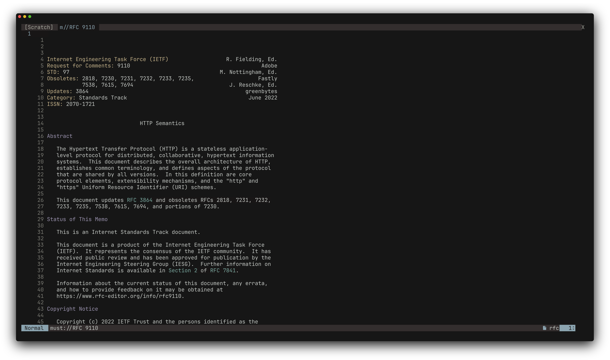
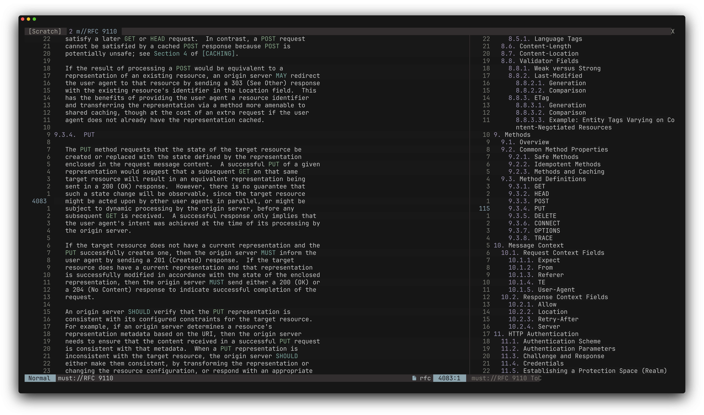

<div align="center">

# must.nvim

**RFC inside Neovim, because why not?**

[](https://www.lua.org)
[](https://neovim.io)

</div>




## Usage

Run `:Must <number>` to open a new instance, which is opened in a shared tab for the session. Once inside, `:Must toc` or `\` will toggle open the Table of Contents (if the RFC has one). `gd` within the main content body jumps to sections within the body, other RFCs, and other sections in other RFCs based on the cursor's position.

That's basically it, it's quite simple, and I don't have any grandiose plans to make it overly complex. Caching will be added later down the line.

## Installation

### [lazy.nvim](https://github.com/folke/lazy.nvim)

```lua
{
  "undont/must.nvim",
}
```

### vim.pack

```lua
vim.pack.add({ "https://github.com/undont/must.nvim" })
```

### [mini.deps](https://github.com/nvim-mini/mini.nvim/blob/main/readmes/mini-deps.md)

```lua
MiniDeps.add({
  source = "undont/must.nvim",
})
```
